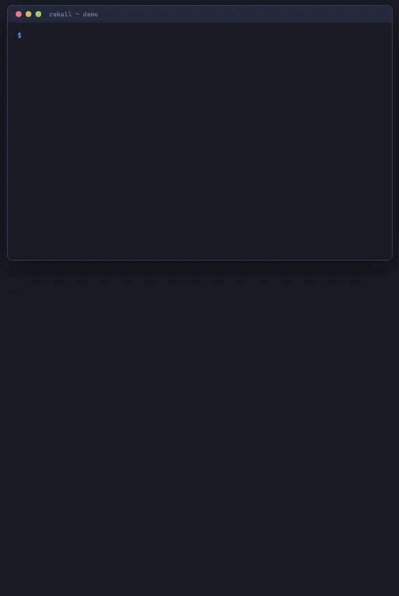

# Rekall — Project State Layer for AI Agents

[](https://github.com/tyreamer/rekall/actions/workflows/ci.yml)
[](LICENSE)
[](https://www.python.org/downloads/)

**Rekall gives your autonomous coding agents a persistent, machine-readable memory.**

Everything lives in a simple, git-friendly `project-state/` folder (YAML + JSONL). No more hallucinations about what was already tried, what decisions were made, or where the running services actually are.

*Private beta v0.1.0-beta.1 — Feb 25 2026. Coming to PyPI soon.*

---


*15-second demo: agent lifecycle with attempts, decisions, and handoff*

---

## See it in 30 seconds
```bash
# Install directly from GitHub
pipx install git+https://github.com/tyreamer/rekall.git

# Run the mocked demo lifecycle
rekall demo
```

### What does the actual state look like?
Rekall is just a folder of human-readable files that agents can easily parse and update. No complex database, no hidden state.

```text
project-state/
├── project.yaml       # Metadata, goals, and constraints
├── activity.jsonl     # High-level work items (Todo/In-Progress)
├── attempts.jsonl     # Typed ledger of what has been tried
├── decisions.jsonl    # Explicit architectural trade-offs
└── timeline.jsonl     # Immutable event log
```

**Example Record (attempts.jsonl):**
```json
{
  "attempt_id": "a1b2c3d4",
  "work_item_id": "wi_105",
  "title": "Migrate DB to Postgres",
  "outcome": "failed",
  "rationale": "RDS instance was not reachable in subnet 'sn-99'",
  "evidence_refs": ["logs/deploy_error.log"]
}
```

```bash
# Get a quick executive summary
rekall status --store-dir ./project-state

[ON_TRACK] Target: Cloud Migration v1
Status: 85% confidence. 2 active blockers.
Decisions: [d1] Use S3 for assets, [d2] Lambda for processing.
Recent Attempt: [a1] Deploy API (failed) -> Rationale: VPC Timeout.
```

---

## Core Concepts
Rekall is a **project reality blackboard + ledger**, not a task manager. It provides the missing state layer that agents need:

- **Attempts**: A typed ledger of what has been tried. Agents learn from past failures instead of repeating them.
- **Decisions**: Explicit records of trade-offs. Context is preserved permanently.
- **Timeline**: An immutable event log of milestones and state changes.
- **Environment Pointers**: Typed references to environments and access methods.

*Rekall also provides native **Idempotency** (preventing duplicate agent actions) and **Checkpointing** (durable save-points).*

---

## Core Commands
- `rekall status` — Quick executive summary of the current reality.
- `rekall guard` — Preflight check: summarized goals, risks, and recent work.
- `rekall blockers` — List active blockers and their estimated impact.
- `rekall handoff <project_id>` — Generate a `boot_brief.md` for the next agent session.
- **MCP-Native** — First-class support for Claude Desktop and Cursor (`python -m rekall.server.mcp_server`).

---

## When to use Rekall
| Use Rekall when... | Do NOT use Rekall when... |
| :--- | :--- |
| Operating autonomous AI agents | You just need a visual Trello board |
| Losing context between pair-sessions | You want two-way sync with Jira/Linear |
| You need a local, git-portable state | You are building non-technical products |

---

## Go Deeper
1. [Quickstart](docs/QUICKSTART.md) — Initialize your own project.
2. [Beta Guide](docs/BETA.md) — What to try and how to provide feedback.
3. [Connecting Clients](docs/CONNECTING_CLIENTS.md) — Claude Desktop, Cursor, and more.
4. [Advanced Docs](docs/) — Idempotency, Checkpointing, and MCP Validation.


---

## Ready to give your agents memory?
```bash
# Zero-friction install
pipx install git+https://github.com/tyreamer/rekall.git

# Try the demo
rekall demo
```

⭐ **Star this repo** if this solves a real pain for you.  
🐦 **Follow [@TyReamer](https://x.com/tyreamer)** for updates and beta announcements.

---

### Status
`v0.1.0-beta.1` — Private beta (2026-02-25). See [CHANGELOG.md](CHANGELOG.md) for details.

*Note: `rekall.io` domain is reserved for future hosted services.*
